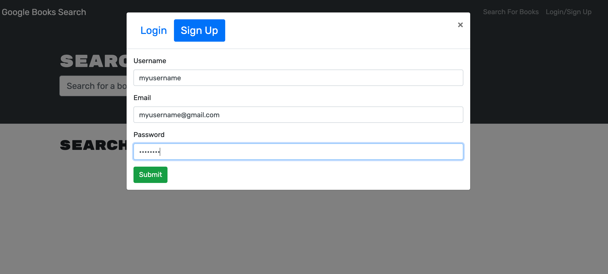
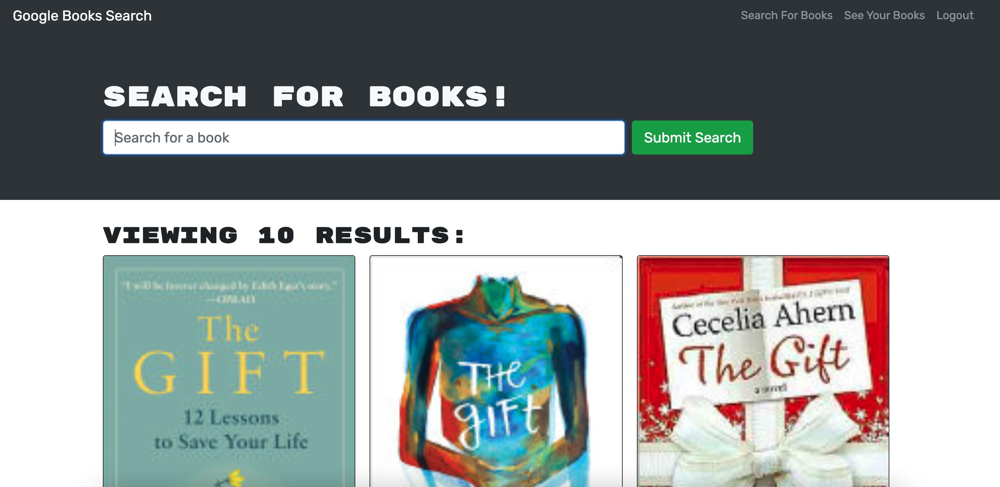
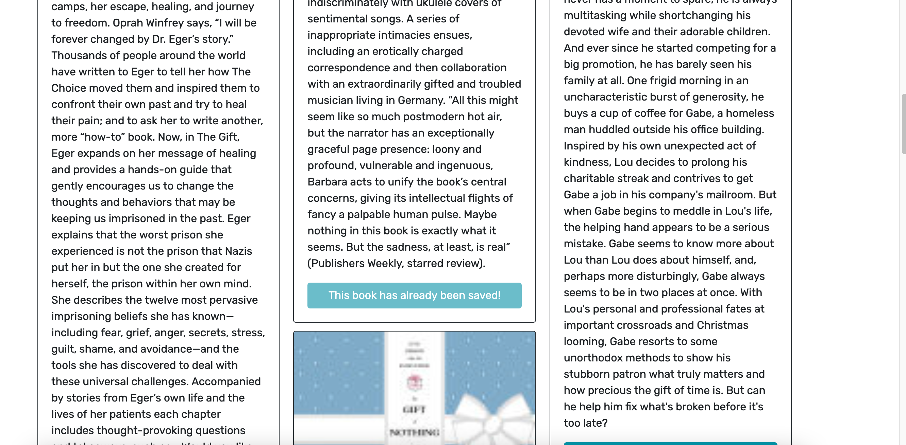
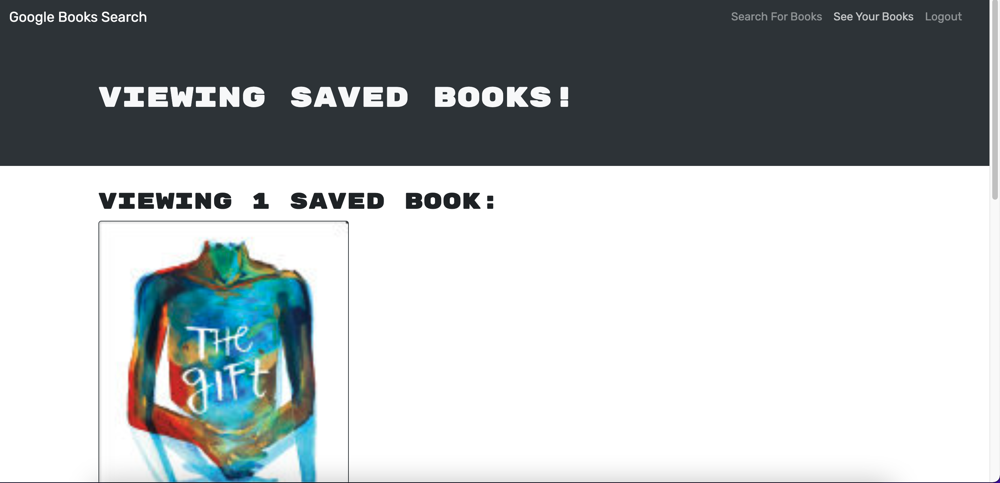

# book-search

[](https://opensource.org/licenses/Artistic-2.0)

## Description
Search your favorite books and save them to your account to read later. just Sign up.
Using React as front end and Express, MongoDB, and Node.js as back end with dependencies such as graphQl and Apollo server in the back end, we have this application to search for books. MERN

## Table of Contents

* [Demo](#demo)
* [Deployment](#deployment)
* [Usage](#usage)
* [License](#license)
* [Contribution](#contribution)
* [Questions](#questions)

## Demo

""
 ""
 ""
 ""


## Deployment

click here to view the application:
https://walterlaw19.github.io/react-portfolio/

## Usage
you can use this code to create your own application to search for books using MERN.
 
## License

[](https://opensource.org/licenses/MIT)

## contribution

Please send me an email if you can want to contribute or submit any suggestions: walterlaw19@gmail.com

## Questions

If you have any questions or concerns, you can reach me at: walterlaw19@gmail.com

or visit my GitHub: https://github.com/walterlaw19

```
Made by by Walter G
```

---
##### © 2021 WG.